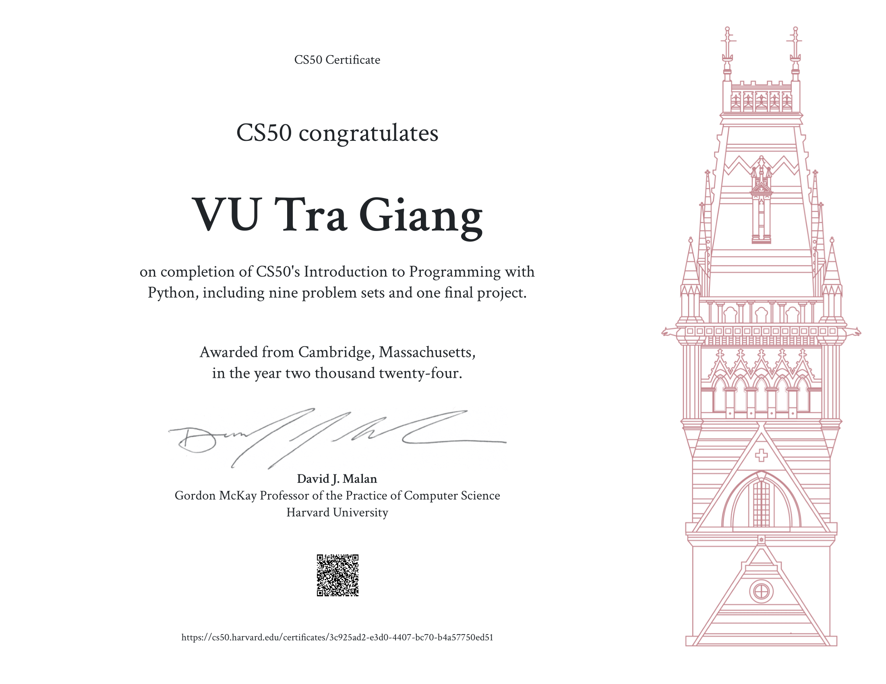

# 🐍 CS50’s Introduction to Programming with Python – 2024

Welcome to my repository of **solved problem sets** from Harvard's [CS50’s Introduction to Programming with Python](https://cs50.harvard.edu/python/) – 2024 edition. This course is part of the CS50 series and offers a hands-on, structured approach to Python for beginners and aspiring developers alike.

---

## 📜 What’s in this repo?

This repository contains my completed solutions to each problem set from the course.
Each directory corresponds to a weekly problem set from the course:

- `set0/` – Functions, Variables
- `set1/` – Conditionals
- `set2/` – Loops
- `set3/` – Exceptions
- `set4/` – Libraries and Packages
- `set5/` – Unit tests
- `set6/` – File I/O 
- `set7/` – Regular expressions
- `set8/` – Object-Oriented Programming

---

## 🏆 Certificate
<!-- Replace with your actual image path once uploaded -->

---

## 💡 Why this repository?

- ✅ To track my learning journey  
- ✅ To serve as reference for me (and maybe others)

---

## 🧰 Tools Used

- Python 3+
- Visual Studio Code / VS Code with `check50` and `submit50` installed
- Git & GitHub
- `pytest` for unit testing

